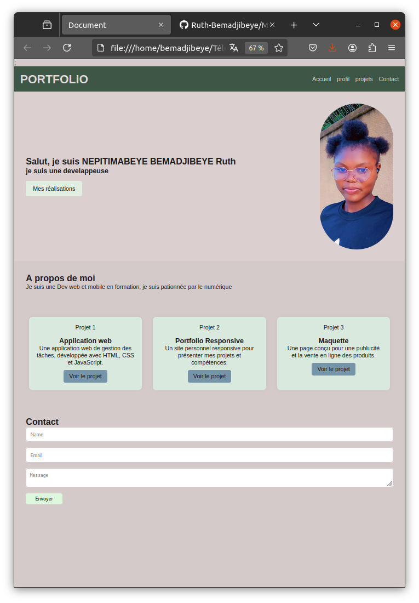

# Portfolio - Ruth NEPITIMABEYE BEMADJIBEYE

## 📝 Description
Portfolio personnel présentant mes projets et compétences en développement web et mobile. Une vitrine interactive de mon parcours dans le développement d'applications.

## 🛠 Technologies Utilisées
- HTML5
- CSS3
- JavaScript
- Font Awesome pour les icônes
- Google Fonts (Poppins, Inter)
- GitHub Pages pour l'hébergement

## ✨ Fonctionnalités
- Design responsive adapté à tous les appareils
- Animations fluides et interactives
- Navigation intuitive
- Section projets avec présentations détaillées
- Formulaire de contact
- Intégration des réseaux sociaux

## 🚀 Projets Présentés
1. **Application Web de Gestion des Tâches**
   - Application de gestion de tâches développée en HTML, CSS et JavaScript
   - Interface utilisateur intuitive et responsive

2. **Portfolio Responsive**
   - Site personnel responsive pour présenter mes projets
   - Design moderne et adaptatif

3. **Maquette E-commerce**
   - Page conçue pour la publicité et la vente en ligne
   - Focus sur l'expérience utilisateur et le design

## 📸 Capture d'écran


## 🔧 Installation et Utilisation
1. Clonez le repository
   ```bash
   git clone https://github.com/Ruth-Bemadjibeye/PORTFOLIO.git
   ```
2. Ouvrez `index.html` dans votre navigateur
3. Ou visitez la version en ligne : [ruth-bemadjibeye.github.io/PORTFOLIO](https://ruth-bemadjibeye.github.io/PORTFOLIO)

## 📫 Contact
N'hésitez pas à me contacter pour toute collaboration ou question !

## 📝 Licence
Ce projet est sous licence MIT - voir le fichier [LICENSE](LICENSE) pour plus de détails.
